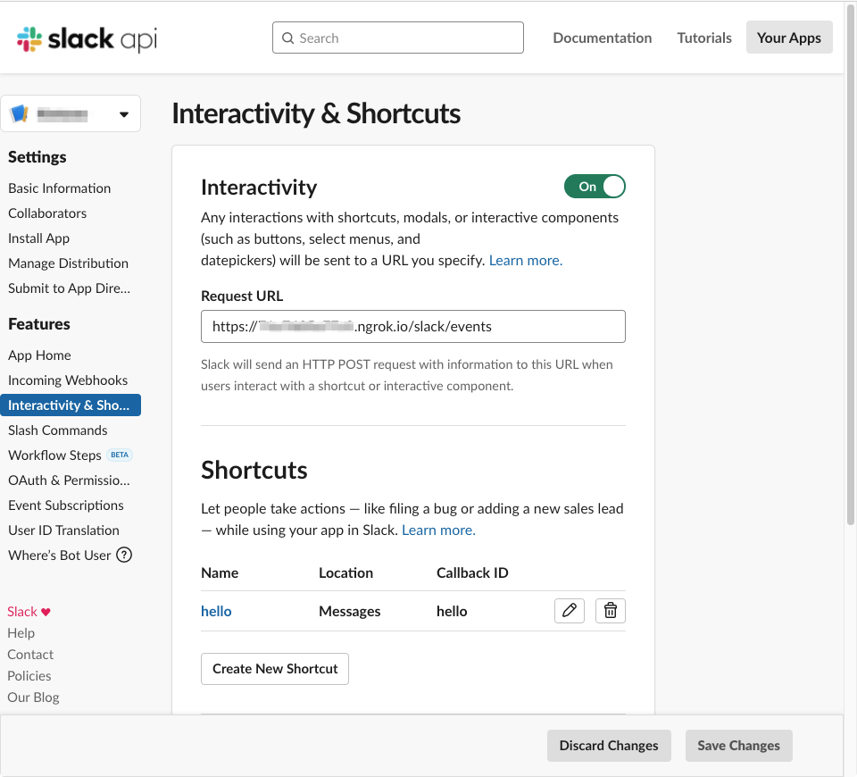
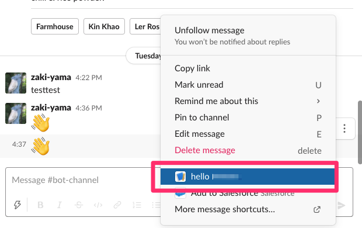
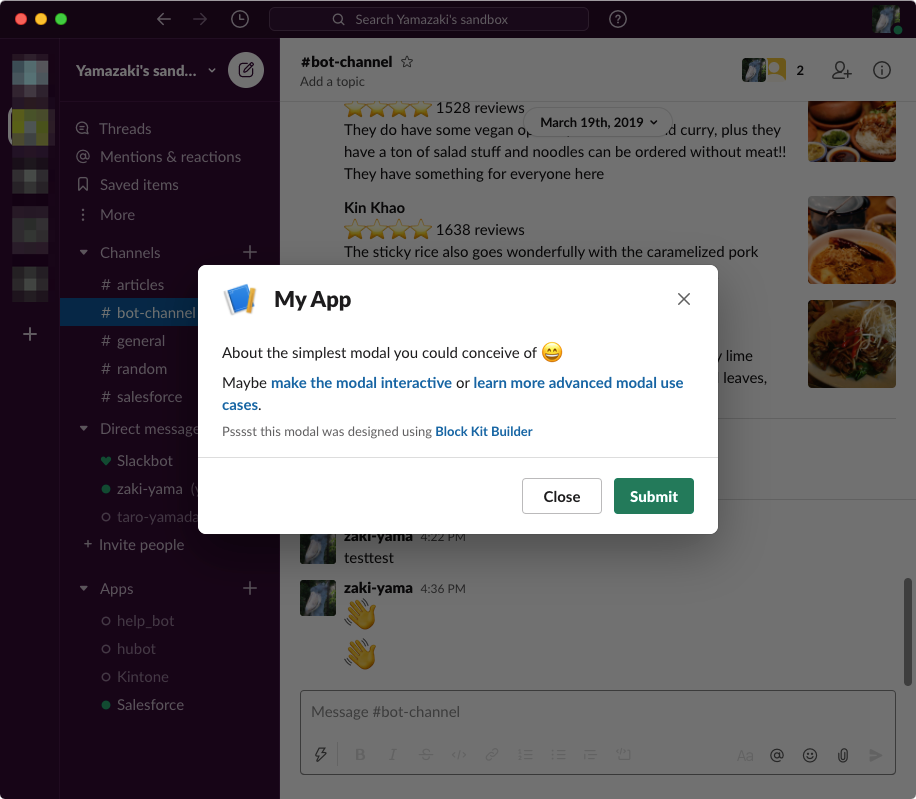

Slack Bolt Playground
=====================

Sample Slack App built with [Bolt](https://github.com/slackapi/bolt-js).  
[Bolt](https://github.com/slackapi/bolt-js) フレームワークを使用したサンプル Slack アプリ。

ref. [Bolt 入門ガイド](https://slack.dev/bolt-js/ja-jp/tutorial/getting-started)

### Installation & Usage

- https://slack.dev/bolt-js/ja-jp/tutorial/getting-started を参考に、
  - Slack アプリの作成
  - トークンの作成 (スコープは `commands`)
  - ngrok のインストール
  - を行う
- 作成した Slack アプリの "Interactivity & Shortcuts" から shortcut を作成 (Callback ID は `hello`)
- 取得したトークンの設定、アプリの起動、ngrok の起動を行う

```sh
# リポジトリのクローン
$ git clone https://github.com/zaki-yama-labs/slack-bolt-playground
$ cd slack-bolt-playground

# 環境変数の設定
$ export SLACK_SIGNING_SECRET=<your-signing-secret>
$ export SLACK_BOT_TOKEN=xoxb-<your-bot-token>

# アプリの起動
$ npm start

# (別ウィンドウで) ngrokを起動
$ ngrok http 3000
Session Status                online
Account                       foo@example.com (Plan: Free)
Version                       2.3.35
Region                        United States (us)
Web Interface                 http://127.0.0.1:4040
Forwarding                    http://xxxxxx.ngrok.io -> http://localhost:300
Forwarding                    https://xxxxxx.ngrok.io -> http://localhost:300
```

- 起動した ngrok の `https://xxxxx.ngrok.io` という URL をコピーし、Slack アプリの設定の "Interactivity & Shortcuts" の Request URL に貼り付ける
  - その際、URL 末尾に `/slack/events` を追加する




- Slack の投稿から shortcut message を選択する -> モーダルが表示される





#### :warning:
ngrok は再起動するたびに URL 変わるので Slack アプリ側も更新が必要

### Features

- [x] [Shortcuts](https://slack.dev/bolt-js/concepts#shortcuts)
- [x] [View Submissions (Modal)](https://slack.dev/bolt-js/concepts#view_submissions)
- [ ] Actions
- [ ] Events
- [ ] Commands
